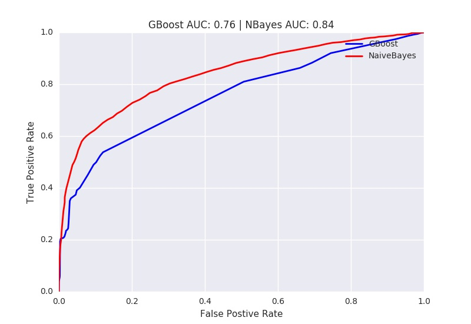

# HOL Index
---
HOL Index is a tool to track offensive language in social media over time and develop a barometer for how much 'hate speech' is going on in the U.S. at a given point in time.  It uses a Naive Bayes model to classify tweets as either offensive or not offensive.  It was trained on a set of subreddits from the May 2015 Kaggle Reddit dataset, and then cross-validated using some labeled tweets from CrowdFlower.  

## Motivation
During and after the 2016 election cycle, hate speech, especially online, became the focus of many media stories.  However, no quantifiable "barometer" or "index" exists to monitor the frequency of hate speech in the social media corpus.  Secondary metrics, such as number of hate crimes reported over a given period of time, are what are relied upon currently.

The goal here was to build a barometer/index in order to measure the amount of hate speech on a given day, such that it could be referred to and measure "progress" or "regress" against efforts to curb this activity.

## Data

There were two datasets used in this project. The training set came from selected subreddits from the May 2015 reddit data dump. This dataset is avaible from [Kaggle]( https://www.kaggle.com/c/reddit-comments-may-2015 ) as a Sqlite database. The subreddits were selected so that the model would see offensive and not offensive comments on the same subject. For example, both /r/TheRedPill and /r/women were selected because they discuss woman's rights. However /r/TheRedPill is extremely misogynistic while /r/women is not.

Table of final offensive and not offensive subreddits used:

| Category | Subreddit Name | Number of comments|
|:----: | :---: | :----: |
| Offensive | /r/CoonTown | 51979 |
| Offensive  | /r/WhiteRights | 1352 |
| Offensive | /r/Trans_fags | 2362 |
| Offensive | /r/SlutJustice | 309 |
| Offensive | /r/TheRedPill | 59145 |
| Offensive | /r/KotakuInAction | 128156 |
| Offensive | /r/IslamUnveiled | 5769 |
| Offensive | /r/GasTheKikes | 919 |
| Offensive | /r/AntiPOZi | 4740 |
| Offensive | /r/fatpeoplehate | 311183 |
| Offensive | /r/TalesofFatHate | 5239 |
| Not Offensive | /r/politics | 244927 |
| Not Offensive | /r/worldnews | 490354 |
| Not Offensive | /r/history | 25242 |
| Not Offensive | /r/blackladies | 4396 |
| Not Offensive| /r/lgbt | 8253 |
| Not Offensive | /r/TransSpace | 472 |
| Not Offensive | /r/women | 529 |
| Not Offensive | /r/TwoXChromosomes | 105130 |
| Not Offensive | /r/DebateReligion | 41015 |
| Not Offensive | /r/religion | 2623 |
| Not Offensive | /r/islam | 25443 |
| Not Offensive | /r/Judaism | 9103 |
| Not Offensive | /r/BodyAcceptance | 579 |
| Not Offensive | /r/AskMen | 138839 |
| Not Offensive | /r/AskWomen | 137889 |

The second dataset was labeled Twitter hate speech dataset from [Crowdflower](https://www.crowdflower.com/data-for-everyone/). This dataset was split into a validation set and test set. The validation set was used to tune the hyper parameters for both models. The Twitter hate speech dataset was split so that there would be a even class balance in both the validation and test set.

## TF-IDF Model

### Tokenization

Unlike doc2vec, tf-idf is only interested in the frequency at which a word appears in a corpus. Hence, stemming and punctuation removal is necessary. The snowball stemmer and word_tokenize functions from nltk were applied to tokenize the reddit comments before training.

### Training

Gradient Boosting and Naive Bayes methods were used to train the tf-idf model. The resulting feature matrix from tf-idf was extremely large and required a memory optimized instance on Amazon Web Services in order to train on it.

As you can see below, Naive Bayes outperformed Gradient Boosting with the hyperparmeters I used; however, I was compute-limited on Gradient Boosting, and with more time might have been able to develop a higher-performing boosting model.

## Acknowledgements
I was more of a 'stitcher' than a 'visionary' in this project, thanks in large part to the following folks:

- [Emily Y. Spahn](https://github.com/eyspahn/OnlineHateSpeech) - for showing how to use the Reddit Kaggle database to train on.
- [Maneesh Gupta](https://github.com/mgupta011235/TweetSafe) - for providing much of the groundwork for this project through his very well-documented code for his brilliant web app, TweetSafe!  
- [Timothy Quinn](https://www.hatebase.org/hatebrain) - for providing great data from his online scraper, HateBrain.
- My instructors at Galvanize, including Dan Brehmer, Dan Wiesenthal and Cary Goltermann 
